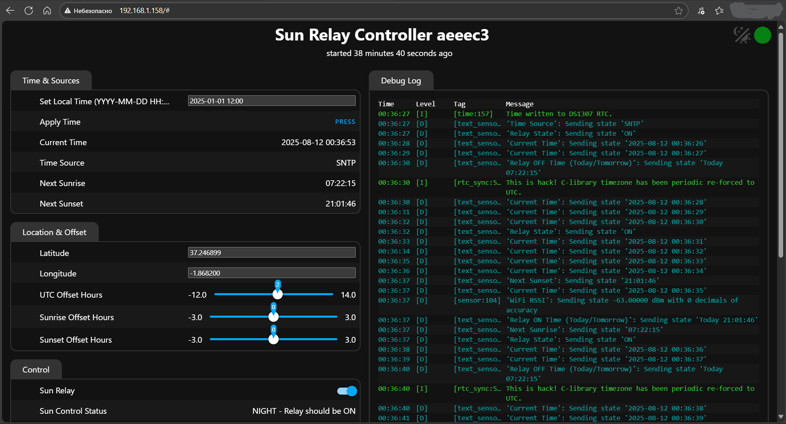
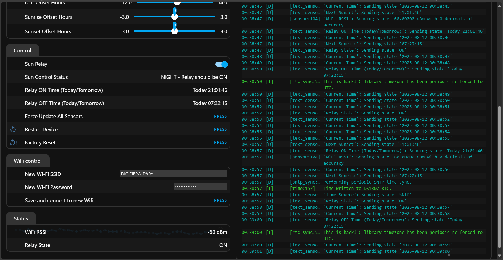
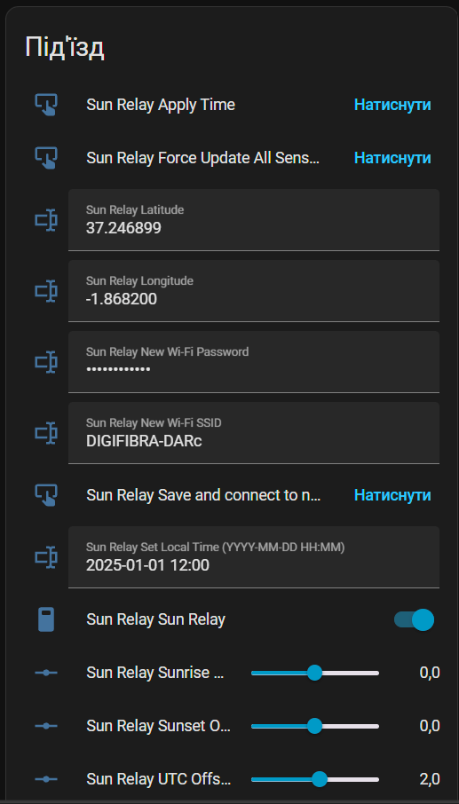
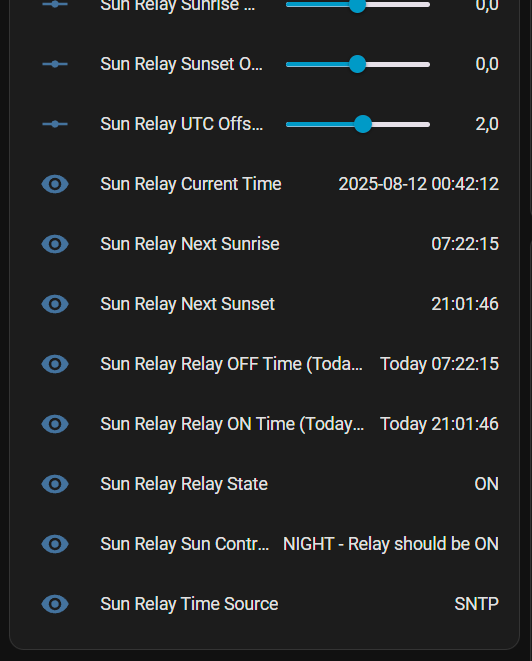

# Sun Relay Controller

  
 

## [🇺🇦 Українська версія](#ukrainian-version)

## What is Sun Relay?

Sun Relay is a fully autonomous, smart controller designed to manage lighting based on the daily cycle of the sun. It's an ideal "set it and forget it" solution for:

* Street and landscape lighting.
* Entrance and hallway lights in apartment buildings.
* Any other lighting system that should automatically turn on at night and off during the day.

The core feature of this device is its reliability. It does not require an internet connection or any external servers to perform its main function, thanks to a built-in hardware clock and a robust internal logic.

---

## Hardware Setup

### Required Materials
* An ESP8266-based board (like **Wemos D1 Mini**).
* A 5V Relay Module.
* A DS1307 or DS3231 RTC (Real-Time Clock) Module (optional, but highly recommended for offline reliability).
* Connecting wires.

### Wiring

Connect the components according to the following scheme:

| Wemos D1 Mini Pin | Connects to...                  |
| :---------------- | :------------------------------ |
| **5V** | Relay Module `VCC`, RTC `VCC`   |
| **GND** | Relay Module `GND`, RTC `GND`   |
| **D1 (SCL)** | RTC Module `SCL`                |
| **D2 (SDA)** | RTC Module `SDA`                |
| **D5** | Relay Module `IN` (Input)       |

---

## First-Time Setup & Configuration

The device is managed entirely through its web interface.

### 1. First Boot & Wi-Fi Provisioning
After flashing the firmware, the device will not know your Wi-Fi credentials.
1.  On its first boot, the device will create its own Wi-Fi Access Point named **`sun-elay-MAC`** with the password `12345678`.
2.  Connect to this network with your phone or laptop.
3.  Open a web browser and go to `192.168.4.1`.
4.  You will see the device's web interface. Use the **"WiFi control"** section to enter your home Wi-Fi SSID and password and click **"Save and connect to new Wifi"**.
5.  The device will restart and connect to your network. Find its new IP address from your router to access the interface again.

### 2. Main Configuration
For the device to work correctly, you must set the following parameters in the web interface:

* **`Latitude` & `Longitude`**: These are the most critical settings. You must enter the geographic coordinates of the device's location. You can get them from Google Maps or other online services.
* **`UTC Offset Hours`**: Set your local timezone's offset from UTC. For example, for Central European Summer Time (CEST), this would be `2.0`.
* **`Set Local Time` (for offline use)**: If the device has no internet, its clock may be incorrect. Enter the current local time in `YYYY-MM-DD HH:MM` format and press **"Apply Time"**. The device will set its internal clock and save it to the RTC for future reboots.

### 3. Fine-Tuning (Optional)
* **`Sunrise Offset Hours` & `Sunset Offset Hours`**: These sliders allow you to make the relay switch earlier or later relative to the actual sunrise or sunset. For example, setting the sunset offset to `-0.5` will turn the lights on 30 minutes *before* sunset.

---

## Operating Algorithm

The device's logic is simple and reliable:

1.  Based on its coordinates and the current time, the controller calculates the astronomical sunrise and sunset times.
2.  The core rule is: **the relay is ON during the night and OFF during the day.**
3.  For safety, the device always turns the relay **ON** immediately after booting. This ensures that a brief power outage at night will not leave the area in darkness. The device will then correct its state within seconds based on the sun's position.

---

## Technical Features & Implementation Details

This firmware is built to be exceptionally robust by using several advanced techniques to overcome common ESPHome limitations.

* **Hybrid Time System:** The device uses a three-tiered time system for maximum reliability:
    1.  **SNTP:** The primary source when online, providing perfect accuracy.
    2.  **DS1307/DS3231 RTC:** The hardware backup. Time is automatically synced from SNTP to the RTC. On boot, time is read from the RTC to ensure the device has a valid time even before Wi-Fi connects.
    3.  **Manual Set:** A user-friendly override for fully offline environments.

* **UTC Core Principle:** All internal logic and time storage (in the RTC) is done strictly in **UTC**. This avoids all ambiguity related to local time and Daylight Saving changes. User-facing times are converted to local time for display only.

* **"Hacks" for Reliability:**
    * **Forced UTC Environment:** An `on_boot` script forces the ESP8266's low-level C-library to a UTC timezone (`setenv("TZ", "UTC0", 1)`). This is a critical fix that ensures the `sun` component calculates its values in UTC, preventing a common source of bugs.
    * **Robust Hardware Handling:** The firmware automatically detects if an RTC module is present and working (`is_failed()` check). If not, it operates without it and without generating errors. It also validates the time read from the RTC to protect against data corruption.
    * **Factory Reset Recovery:** A "magic flag" (`is_configured_flag`) in persistent memory ensures that after a full device reset, all settings are gracefully restored to safe, pre-defined defaults.

* **A Note on `#include` Directives:** This code intentionally avoids using top-level `includes:` for standard C libraries like `<time.h>`. These are already part of the ESPHome build framework, and including them again can cause compilation conflicts. This directive should be reserved for external, custom C++ header files.
  ## Home Assistant Integration

## Home Assistant Integration

### Automatic Discovery
If you are using the ESPHome integration, the device will be automatically discovered by your Home Assistant instance. All controls and sensors from the web interface will appear as corresponding entities.

**Note:** For this to work, the `api:` section in the `sun-relay.yaml` file must be enabled.

### Philosophy of Autonomy
The key idea behind this project is **reliability and full autonomy**. The device does not depend on Home Assistant to perform its primary task. Even if your Home Assistant server is offline, this controller will continue to switch the lights on and off perfectly according to the sunrise and sunset schedule.

### Role in Home Assistant: A Rich Data Source
Because of its autonomous nature, the device's core sun-tracking logic is not controlled by Home Assistant. Instead, it serves as a **rich data source and sensor platform**, providing your smart home with precise and reliable astronomical data.

You will get a suite of useful entities, including:
* **Astronomical Events:** `sensor.next_sunrise` and `sensor.next_sunset`.
* **Calculated Relay Times:** `sensor.relay_on_time` and `sensor.relay_off_time`, which include any user-defined offsets.
* **Device Status:** `switch.sun_relay` (for monitoring and manual override), `sensor.time_source`, and `sensor.wifi_signal`.

This allows you, for example, to trigger other automations (like closing blinds or changing indoor lighting) based on the data from this device, which can be more reliable and customized than HA's built-in sun integration.

## License

This project is licensed under the MIT License - see the LICENSE file for details.

## Contributing

Pull requests are welcome. For major changes, please open an issue first to discuss what you would like to change.

 
---

## Українська версія

## [English Version](#top)

## Що таке Sun Relay?

Sun Relay — це повністю автономний, розумний контролер, призначений для керування освітленням на основі добового циклу сонця. Це ідеальне рішення формату "налаштував і забув" для:

* Вуличних та ландшафтних ліхтарів.
* Освітлення у під'їздах та на сходових клітках багатоквартирних будинків.
* Будь-яких інших систем освітлення, які мають автоматично вмикатися вночі та вимикатися вдень.

Ключова риса цього пристрою — його надійність. Він не потребує підключення до Інтернету чи будь-яких зовнішніх серверів для виконання своєї основної функції, завдяки вбудованому апаратному годиннику та надійній внутрішній логіці.

---

## Налаштування "заліза"

### Необхідні матеріали
* Плата на базі ESP8266 (наприклад, **Wemos D1 Mini**).
* Модуль реле на 5В.
* Модуль RTC (годинника реального часу) DS1307 або DS3231 (опціонально, але наполегливо рекомендується для надійності в офлайн-режимі).
* З'єднувальні дроти.

### Схема підключення

З'єднайте компоненти згідно з наступною схемою:

| Пін Wemos D1 Mini | Підключається до...             |
| :---------------- | :------------------------------ |
| **5V** | Модуль реле `VCC`, RTC `VCC`    |
| **GND** | Модуль реле `GND`, RTC `GND`    |
| **D1 (SCL)** | Модуль RTC `SCL`                |
| **D2 (SDA)** | Модуль RTC `SDA`                |
| **D5** | Модуль реле `IN` (вхід)         |

---

## Перший запуск та конфігурація

Керування пристроєм повністю здійснюється через його вебінтерфейс.

### 1. Перше завантаження та налаштування Wi-Fi
Після прошивки пристрій не знатиме даних вашої Wi-Fi мережі.
1.  При першому запуску пристрій створить власну точку доступу Wi-Fi з назвою **`sun-elay-MAC`** та паролем `12345678`.
2.  Підключіться до цієї мережі з телефону або ноутбука.
3.  Відкрийте браузер і перейдіть за адресою `192.168.4.1`.
4.  Ви побачите вебінтерфейс пристрою. Використовуйте секцію **"WiFi control"**, щоб ввести назву (SSID) та пароль вашої домашньої мережі Wi-Fi і натисніть **"Save and connect to new Wifi"**.
5.  Пристрій перезавантажиться і підключиться до вашої мережі. Знайдіть його нову IP-адресу у вашому роутері, щоб знову отримати доступ до інтерфейсу.

### 2. Основні налаштування
Щоб пристрій працював коректно, ви повинні налаштувати наступні параметри у вебінтерфейсі:

* **`Latitude` & `Longitude`**: Найважливіші налаштування. Ви повинні ввести географічні координати місця, де встановлено пристрій. Їх можна отримати з Google Maps або інших онлайн-сервісів.
* **`UTC Offset Hours`**: Встановіть зміщення вашого локального часового поясу відносно UTC. Наприклад, для центральноєвропейського літнього часу (EEST/Київ) це буде `3.0`.
* **`Set Local Time` (для офлайн-використання)**: Якщо пристрій не має доступу до Інтернету, його годинник може бути неточним. Введіть поточний локальний час у форматі `РРРР-ММ-ДД ГГ:ХХ` та натисніть **"Apply Time"**. Пристрій встановить свій внутрішній годинник і збереже його в RTC для майбутніх перезавантажень.

### 3. Тонке налаштування (опціонально)
* **`Sunrise Offset Hours` & `Sunset Offset Hours`**: Ці повзунки дозволяють вмикати/вимикати реле раніше чи пізніше відносно фактичного сходу чи заходу сонця. Наприклад, встановлення зміщення заходу на `-0.5` увімкне світло за 30 хвилин *до* заходу сонця.

---

## Алгоритм роботи

Логіка пристрою проста та надійна:

1.  На основі своїх координат та поточного часу, контролер кожні 10 секунд обчислює астрономічний час сходу та заходу сонця.
2.  Основне правило: **Реле УВІМКНЕНЕ вночі та ВИМКНЕНЕ вдень.**
3.  З міркувань безпеки, пристрій завжди **вмикає реле** одразу після завантаження. Це гарантує, що коротке відключення електроенергії вночі не залишить територію в темряві. Пристрій скоригує свій стан протягом кількох секунд відповідно до положення сонця.

---

## Технічні особливості та деталі реалізації

Ця прошивка створена надзвичайно надійною завдяки використанню кількох просунутих технік для подолання поширених обмежень ESPHome.

* **Гібридна система часу:** Пристрій використовує трирівневу систему часу для максимальної надійності:
    1.  **SNTP:** Основне джерело, коли є онлайн, забезпечуючи ідеальну точність.
    2.  **DS1307/DS3231 RTC:** Апаратний резерв. Час автоматично синхронізується з SNTP в RTC. При завантаженні час зчитується з RTC, щоб пристрій мав валідний час ще до підключення до Wi-Fi.
    3.  **Ручне налаштування:** Зручний спосіб налаштування для повністю автономних умов.

* **Принцип UTC Core:** Вся внутрішня логіка та зберігання часу (в RTC) виконуються строго в **UTC**. Це дозволяє уникнути будь-якої неоднозначності, пов'язаної з місцевим часом та літнім/зимовим часом. Час, що відображається користувачеві, конвертується в локальний лише для виводу на екран.

* **"Хаки" для надійності:**
    * **Примусове UTC-середовище:** Скрипт в `on_boot` примусово встановлює для низькорівневої C-бібліотеки часовий пояс UTC (`setenv("TZ", "UTC0", 1)`). Це критичний фікс, який змушує компонент `sun` розраховувати свої значення в UTC, запобігаючи поширеному джерелу помилок.
    * **Надійна робота з апаратним забезпеченням:** Прошивка автоматично визначає, чи присутній та чи працює модуль RTC (перевірка `.is_failed()`). Якщо ні, вона працює без нього, не генеруючи помилок. Вона також перевіряє валідність часу, зчитаного з RTC, для захисту від пошкодження даних.
    * **Відновлення після скидання:** "Магічний прапорець" (`is_configured_flag`) у постійній пам'яті гарантує, що після повного скидання пристрою всі налаштування будуть коректно відновлені до безпечних значень за замовчуванням.

* **Примітка щодо директив `#include`:** Цей код навмисно уникає використання `includes:` верхнього рівня для стандартних бібліотек C, таких як `<time.h>`. Вони вже є частиною фреймворку збірки ESPHome, і їх повторне включення може викликати конфлікти компілятора. Цю директиву слід резервувати для підключення власних кастомних файлів заголовків C++.

## Інтеграція з Home Assistant

### Автоматичне виявлення
Якщо ви використовуєте інтеграцію ESPHome, пристрій буде автоматично знайдено у вашому Home Assistant. Всі елементи керування та сенсори з вебінтерфейсу з'являться як відповідні сутності (entities).

**Примітка:** Для того, щоб це працювало, секція `api:` у файлі `sun-relay.yaml` має бути увімкнена (розкоментована).

### Філософія автономності
Ключова ідея цього проєкту — **надійність та повна автономність**. Пристрій не залежить від Home Assistant для виконання свого основного завдання. Навіть якщо ваш сервер Home Assistant вимкнеться, контролер продовжить вмикати та вимикати світло за розкладом сходу/заходу сонця.

### Роль у Home Assistant: Джерело даних
Через свою автономну природу, основна логіка пристрою, що відстежує сонце, не керується з Home Assistant. Замість цього, він виступає як **багате джерело даних та платформа сенсорів**, надаючи вашому розумному будинку точні астрономічні дані.

Ви отримаєте набір корисних сутностей, серед яких:
* **Астрономічні події:** `sensor.next_sunrise` та `sensor.next_sunset`.
* **Розрахований час роботи реле:** `sensor.relay_on_time` та `sensor.relay_off_time`, які враховують будь-які встановлені вами зміщення.
* **Статус пристрою:** `switch.sun_relay` (для моніторингу та ручного керування), `sensor.time_source` та `sensor.wifi_signal`.

Це дозволяє вам, наприклад, запускати інші автоматизації (як-от закриття штор або зміна освітлення в кімнаті), спираючись на дані з цього пристрою, що може бути надійніше та гнучкіше, ніж вбудована інтеграція сонця в Home Assistant.

  
## Ліцензія
Цей проект ліцензований під ліцензією MIT - дивіться файл LICENSE для деталей.

## Внесок у проект
Pull request'и вітаються. Для значних змін, будь ласка, спочатку відкрийте issue для обговорення того, що ви хотіли б змінити.
